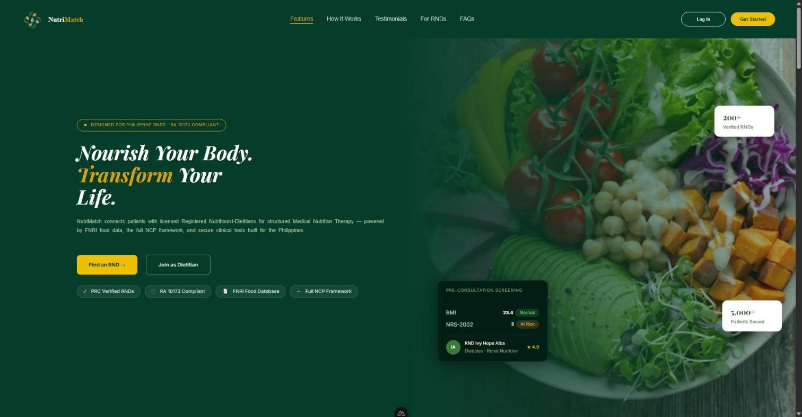

# NutriMatch

**Web-Based Clinical Nutrition Consultation Management System**

Capstone project — STI College Davao, BSIT. Connects clients with licensed Registered Nutritionist-Dietitians (RNDs) in the Philippines for structured **Medical Nutrition Therapy (MNT)**, built around the clinical 4-phase **Nutrition Care Process (NCP)**.



## Getting started

### Backend

```bash
cd backend
python -m venv .venv

# Windows
.venv\Scripts\activate
# macOS/Linux
source .venv/bin/activate

pip install -r requirements.txt
cp .env.example .env

python manage.py migrate
python manage.py createsuperuser
python manage.py runserver
```

### Frontend

```bash
cd frontend
npm install
cp .env.example .env
npm run dev
```

Run both side by side — the frontend needs the backend at `http://localhost:8000` to work.

## Branching & contribution workflow

- `main` is protected — nothing merges in without a pull request and review.
- Branch off `main` for your work:
  ```bash
  git checkout main
  git pull
  git checkout -b feature/<short-description>
  ```
- Push and open a PR into `main` when ready:
  ```bash
  git push -u origin feature/<short-description>
  ```
- Keep PRs scoped to one feature/fix at a time.
